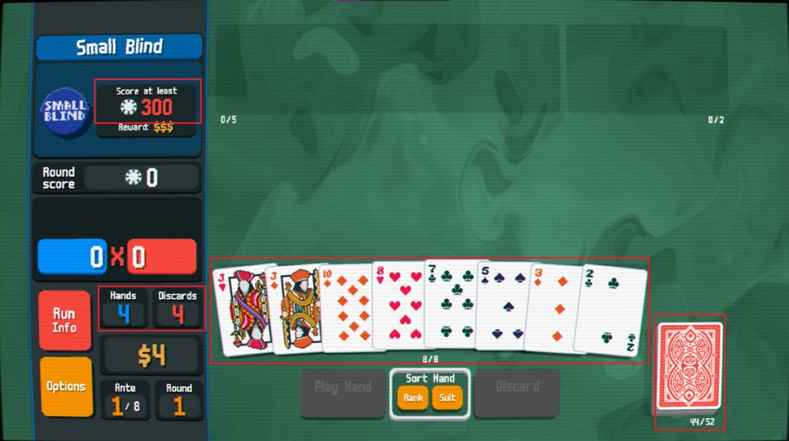

 a standard, face-down, shuffled deck of 52 playing cards (representing remaining cards)
- a face-up (observable) hand of 8 initial cards (subtracted away from the 52 remaining cards)
- knowledge of how many chips each kind of card and poker hand is worth
  - For example: a pair of threes is worth (10 + 3 + 3) chips ⋅ 2 multiplier = 32 chips
- The number of hand actions you can make to accrue points (i.e. chips)
  - A hand action can have 1 - 5 cards, which will be discarded once they are played
  - Of the played cards in a hand action, only those belonging to a poker hand will be scored (e.g. a Jack of hearts, a Jack of diamonds, and a 10 of diamonds is scored as a pair of two Jacks, while the 10 is not considered in the scoring and is effectively discarded)
- The number of discard actions you can make to “replace” cards in your current observable hand for ones in the remaining deck
  - With each discard action, you can discard 1 - 5 cards
  - Like played cards, these cards are then removed from both your observable hand and the rest of the game
  - The number of cards drawn from the remaining cards is equal to the number of cards discarded

If you meet or exceed the minimum score requirement, you win. Otherwise, if you have 0 hands left and have not reached the minimum score requirement, you lose.

Note that the term “hand” is pretty overloaded in Balatro. A hand is either:

- The Observable Hand: your observable hand of 8 face-up cards
- The Hand Action: an action of playing 1 - 5 cards to try and increase your score
- The Poker Hand: a poker hand (e.g. pair, three-of-a-kind, flush, etc.)

We will try to minimize ambiguity by using the terms on the left instead of overloading “hand”.

Formal Description of Balatro

Balatro can be thought of as a poker variant that has a task environment which is: single-agent, partially observable, stochastic, sequential, static, and discrete.

As a search problem, it is described by the following:

States: Please refer to the input description in section **1b.**

Actions: Playing a hand action of 1 - 5 cards or discarding 1 - 5 cards from the observable hand

Result(s,a) → s’:

- If playing a hand action:

1. Lookup the score for the matching poker hand and the individual cards
2. Apply it in order of game mechanics (described below as “point apply order”)
3. Subtract that score from the remaining number of chips needed
4. Remove the cards used from the player’s observable hand
5. Draw that number of cards from the deck
6. Decrement the number of hand actions available

- If discarding:

1. Remove those cards from the player’s observable hand
2. Draw that number of cards from the deck
3. Decrement the number of discards available

Point apply order: Lookup the base chip count and multiply rate for the poker hand. For each card that is being scored (part of the poker hand rules), add its number of chips to the chip count from left to right.

It should be noted that this Result transition function refers to when an AI strategy’s action is submitted to the game simulator, and the simulator returns out the true resulting state. Because the deck is shuffled, and thus the order of the remaining cards to draw from is effectively stochastic, the Result function of our AI strategies themselves will return a set of possible states instead of a single definitive state.

Utility(s,p): The utility of a state will be determined by some objective function to describe how many chips that state would add to the player’s currently scored number of chips.

Policy: Our initial tree-search algorithm will perform searches identical in all but their provided policies, and then it will choose the action from the policy that maximized the utility of that round.

Terminal-Test(s): If the player has a score greater than or equal to the required minimum (after scoring their next played hand), then they win. Otherwise, if the player has no hands left and still has not gained the required minimum score, they lose.

---

Notation = SR (suite and then rank, e.g. S5 is 5 of spades)

S = spades

D = diamonds

C = clubs

H = hearts

A = Ace

K = King

Q = Queen

J = Jack

2 – 10

2-10 are worth 2-10 chips accordingly

J,Q,K are each worth 10 chips (face cards)

A is worth 11 chips

A     (Rank 14)

K       (Rank 13)

Q     (Rank 12)

J     (Rank 11)

2 - 10 (Rank 2 - 10)

---

For the small blind in ante 1, all card multipliers are 1 (no effect).

Further, the deck is a standard deck of 52 cards, with one card per suite and rank combination.

Can play up to 5 cards in a hand.

Cards played in a hand that are not part of a poker hand below are not scored (but are still discarded/removed from player's remaining hand).

You can only ever match one poker hand at a time.

Base poker hand scores are set (chips and multiplier), then card scores are applied to the base poker hand chips and multiplier, from left to right (for scored cards only).

---

Poker Hands     (C: chips, M: multiplier)  - predicate:

Straight Flush  (C: 100, M: 8) - 5 cards, consecutive rank, same suite

Four of a Kind  (C: 60, M: 7)  - 4 cards, same rank

Full House      (C: 40, M: 4)  - 3 cards same rank x, 2 cards same rank y, x ≠ y

Flush           (C: 35, M: 4)  - 5 cards, same suite

Straight        (C: 30, M: 4)  - 5 cards, consecutive rank

Three of a Kind (C: 30, M: 3)  - 3 cards, same rank

Two Pair        (C: 20, M: 2)  - 2 cards same rank x, 2 cards same rank y, x ≠ y

Pair            (C: 10, M: 2)  - 2 cards same rank x

High Card       (C: 5, M: 1)   - 1 card, fall-through case (highest card in played hand is scored if hand does not match a poker hand above)

---

What would let you win this small blind ante of 300 chips in a single hand (assuming any regular cards without multipliers)?

- Straight Flush  (any)

- Four of a Kind  (any)

- Full House      (where scored cards are worth at least 35 chips)

- Flush           (where scored cards are worth at least 40 chips)

- Straight        (where scored cards are worth at least 45 chips)

- Three of a Kind (IMPOSSIBLE: scored cards would need to be worth at least 70 chips, most you could get is 33 chips from 3 aces)

- Two Pair        (IMPOSSIBLE: scored cards would need to be worth at least 130 chips, most you could get is 42 chips from 2 aces and 2 face cards)

- Pair              (IMPOSSIBLE: scored cards would need to be worth at least 140 chips, most you could get is 22 chips from 2 aces)

- High Card       (IMPOSSIBLE: scored card would need to be worth at least 295 chips, most you could get is 11 chips from 1 ace)
---
Action space:

Assume you have 8 cards in your observable hand and can play any combination of 1 to 5 of the cards.
Further, you can play them for 2 kinds of action types: a hand action or a discard action.

That's 2 · (8C5 + 8C4 + 8C3 + 8C2 + 8C1
) actions = 2 · (56 + 70 + 56 + 28 + 8) actions = 436 actions

Once the player exhausts their remaining discard actions, the legal actions are limited to 436/2 = 218 legal actions.

Once the player exhausts their remaining hand actions, the player has reached a terminal state.

Note: in the full Balatro game, we'd have way more actions for several reasons, but mainly because we'd have to use permutations instead of combinations. Once you encounter cards with chip multiplier effects and jokers, the enforcement of left-to-right card order matters. However, this ordering has no effect on the first ante of the game, as cards can only add chips.
